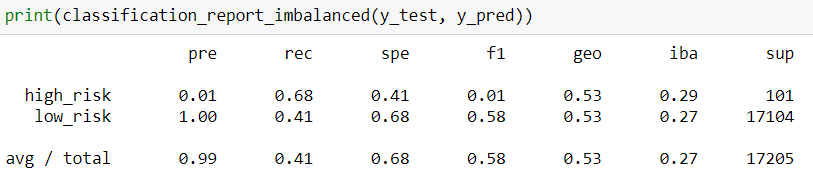
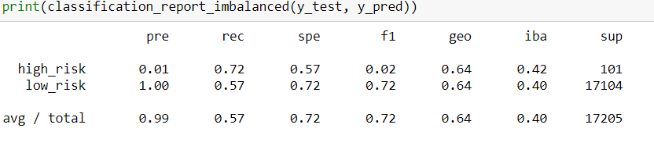

# Supervised Machine Learning

## Project Overview

Credit risk is an unbalanced classification problem, as the number of good loans easily outnumber the number of risky loans.  For this module, one needs to employ different techniques to train and evaluate models with unbalanced classes. Also, needs to use imbalanced-learn and scikit-learn libraries to build and evaluate models using resampling. The final task is to evaluate the performance of these models and make a recommendation on whether they should be used to predict credit risk.

### Objectives

The goals of this challenge:

1. Implement machine learning models.
2. Use resampling to attempt to address class imbalance.
3. Evaluate the performance of machine learning models.

## Resources

Data Source: LoanStats_2019Q1.csv
Software: Python 3.7.6, Anaconda 4.8.4, Jupyter Notebook 6.0.3

## Challenge Overview

 1. Oversample the data using the RandomOverSampler and SMOTE algorithms.
 2. Undersample the data using the cluster centroids algorithm.
 3. Use a combination approach with the SMOTEENN algorithm.
 
For each of the above, you’ll:
  - Train a logistic regression classifier (from Scikit-learn) using the resampled data.
  - Calculate the balanced accuracy score using balanced_accuracy_score from sklearn.metrics.
  - Generate a confusion_matrix.
  - Print the classification report (classification_report_imbalanced from imblearn.metrics).

### Extension

Use 100 estimators for both classifiers, and complete the following steps for each model:

 1. Train the model and generate predictions.
 2. Calculate the balanced accuracy score.
 3. Generate a confusion matrix.
 4. Print the classification report (classification_report_imbalanced from imblearn.metrics).
 5. For the BalancedRandomForestClassifier, print the feature importance, sorted in descending order (from most to least important feature), along with the feature score.
 
### Logistic Regression Summary

Evaluated supervised Machine Learning to assess credit risk. Predicting credit risk with machine learning models by using resampling techniques with logistical regression classifiers and ensemble classifiers to predict whether the load applications are low or high risk.  There is a total of 68,470 of low_risk and 347 of high_risk in the csv file. 

#### Native Random Oversampling

Naive random oversampling algorithm Method. Started with a count of low_risk:51,366 and high_risk: 51,366 target values.  I used the resampled data to train a logistic regression model.  The balanced accuracy score was 0.65.  For the confusion_matrix table, true positive= 70, false negative= 31, false positive= 6,711, and true negative= 10,393. The precision finding for low_risk applicants is 100% unlike high_risk applicants which is 1%.   The average recall is 0.61 See table below for classification_report_imbalanced.  

#### SMOTE Oversampling

SMOTE algorithm Method.  The count of the target values was low_risk:51,366 and high_risk: 51,366.  I used the resampled data to train a logistic regression model.  The balanced accuracy score was 0.66.  For the confusion_matrix table, true positive= 64, false negative= 37, false positive= 5,291, and true negative= 11,813.The precision finding for low_risk applicants is 100% unlike high_risk applicants which is 1%.  The average recall is 0.69. See table below for classification_report_imbalanced.  

#### Undersampling

Using the cluster centroids algorithm method.  The count of the target values was low_risk:246 and high_risk: 246. The balanced accuracy score was 0.54.  For the confusion_matrix table, true positive= 69, false negative= 32, false positive= 10,073, and true negative= 7,031. The precision finding for low_risk applicants is 100% unlike high_risk applicants which is 1%. The average recall is 0.41. See table below for classification_report_imbalanced.  

#### Combination Sampling

Using the combination over- and under-sampling algorithm  method.  The count of the target values was low_risk:62,011 and high_risk: 68,460. The balanced accuracy score was 0.64.  For the confusion_matrix table, true positive= 73, false negative= 28, false positive= 7,412, and true negative= 9,692. The precision finding for low_risk applicants is 100% unlike high_risk applicants which is 1%. The average recall is 0.57. See table below for classification_report_imbalanced.  

### Ensemble Classifier Summary

#### Balanced Random Forest Classifier

Using the Balanced Random Forest Classifier.  The balanced accuracy score was 0.78.  For the confusion_matrix table, true positive= 68, false negative= 33, false positive= 1,749, and true negative= 15,355. The precision finding for low_risk applicants is 100% unlike high_risk applicants which is 4%. The average recall is 0.90. See table below for classification_report_imbalanced. 

#### Easy Ensemble AdaBoost Classifier

Using the Easy Ensemble AdaBoost Classifier.  The balanced accuracy score was 0.93.  For the confusion_matrix table, true positive= 93, false negative= 8, false positive= 983, and true negative= 16,121. The precision finding for low_risk applicants is 100% unlike high_risk applicants which is 9%. The average recall is 0.94. See table below for classification_report_imbalanced.  

